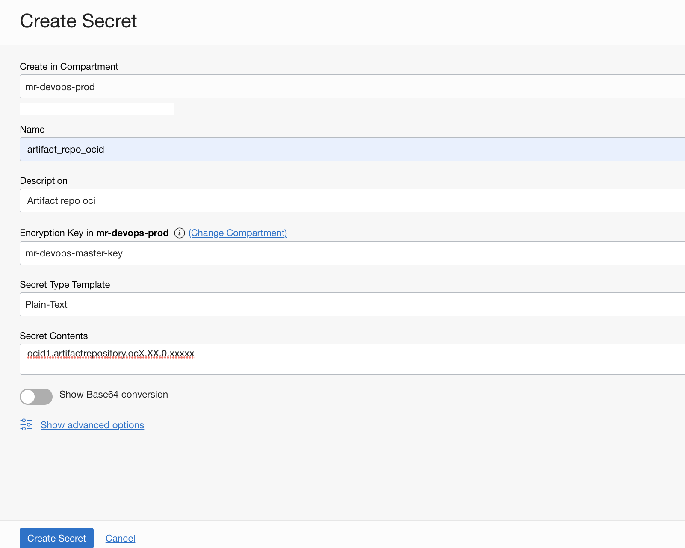
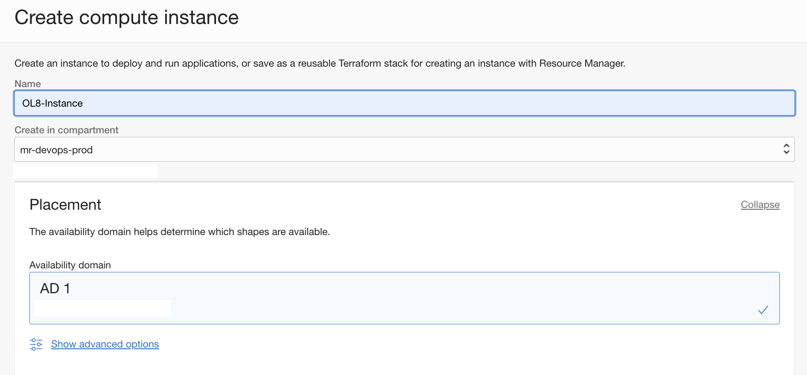
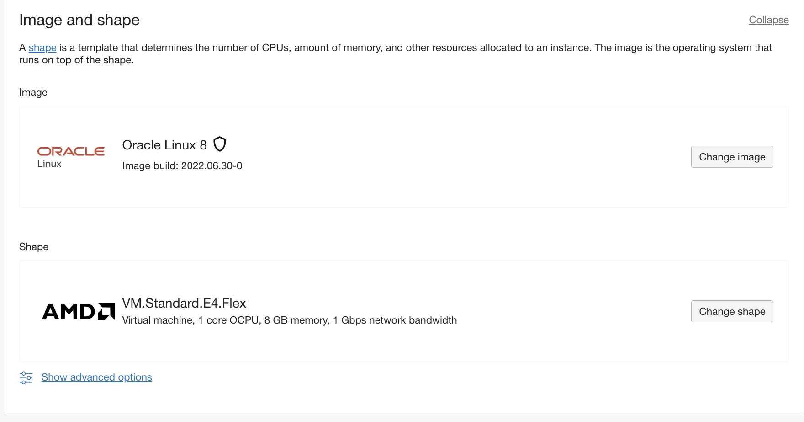
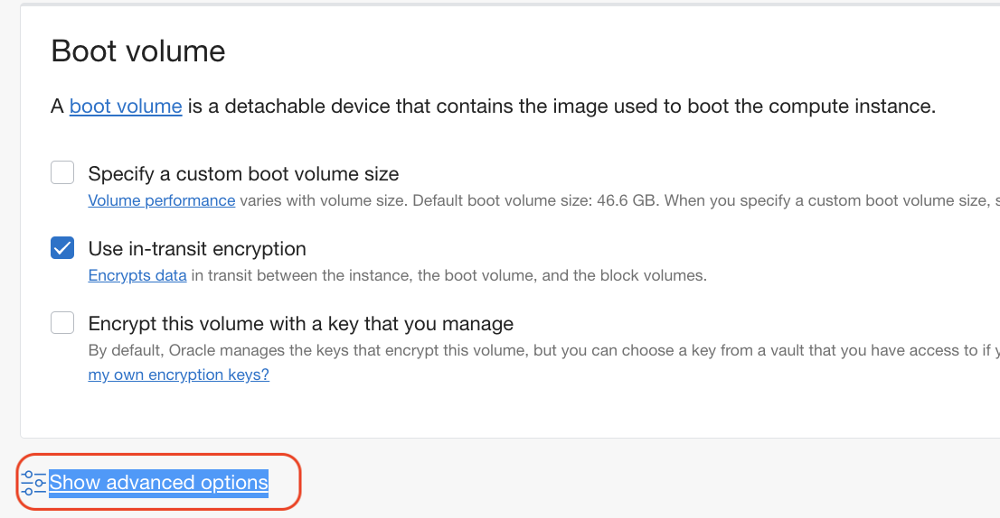
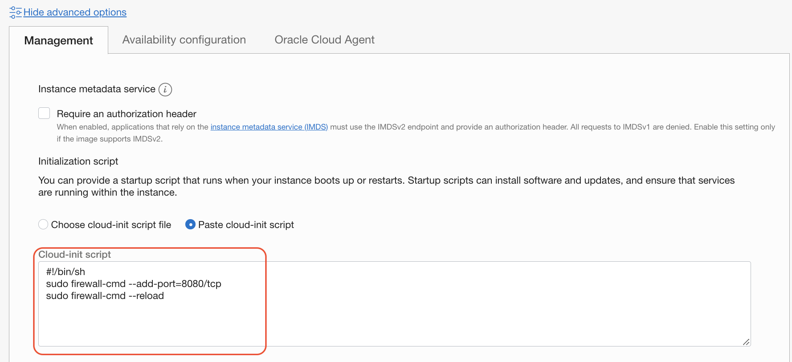
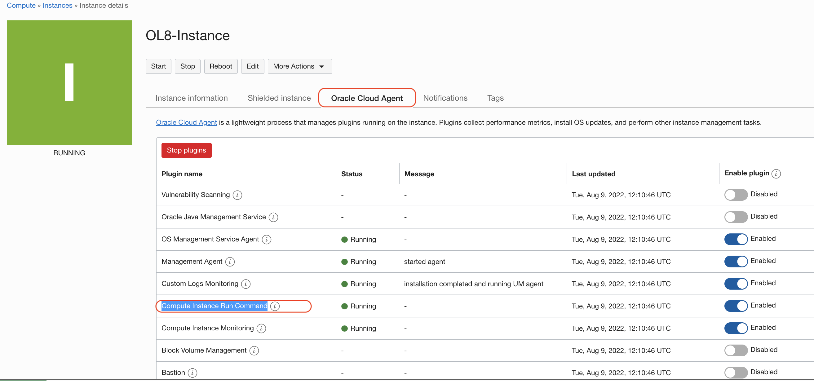
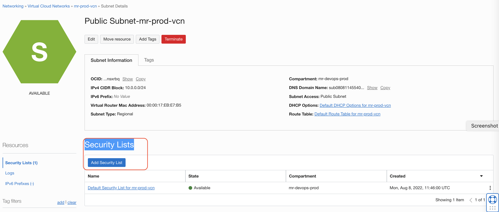
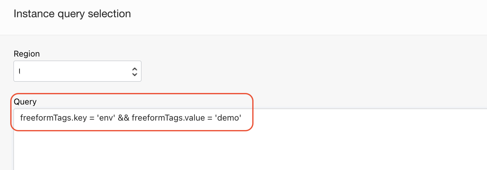
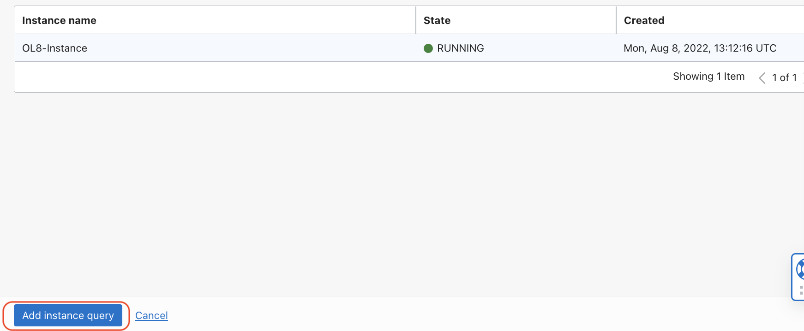

# Using Oracle GraalVM in OCI DevOps to build and Deploy a Micronaut REST App on to OCI Instances

This sample shows how to use `Oracle GraalVM` in `OCI DevOps build pipelines` to build a simple Micronaut hello world REST application. The application will be then deployed to OCI Instances.

## What is GraalVM?

- GraalVM is a high performance JDK distribution that can accelerate any Java workload running on the HotSpot JVM.

- GraalVM Native Image ahead-of-time compilation enables you to build lightweight Java applications that are smaller, faster, and use less memory and CPU. At build time, GraalVM Native Image analyzes a Java application and its dependencies to identify just what classes, methods, and fields are necessary and generates optimized machine code for just those elements.

- Oracle GraalVM is available for use on Oracle Cloud Infrastructure (OCI) at no additional cost.

## What is Micronaut

- Micronaut is a modern, JVM-based framework to build modular, easily testable microservice and serverless applications. By avoiding runtime reflection in favour of annotation processing, Micronaut improves the Java-based development experience by detecting errors at compile time instead of runtime and improves Java-based application start time and memory footprint. Micronaut includes a persistence framework called Micronaut Data that precomputes your SQL queries at compilation time making it a great fit for working with databases like Oracle Autonomous Database, MySQL, etc.

- Micronaut uses GraalVM Native Image to build lightweight Java applications that use less memory and CPUs, and are smaller and faster because of an advanced ahead-of-time compilation technology.


## Specific instruction to clone only this example.

   ```
   $ git init oci-devops-graal-micronaut-deploy-to-instances
   $ cd oci-devops-graal-micronaut-deploy-to-instances
   $ git remote add origin <url to this git repo>
   $ git config core. sparsecheckout true
   $ echo "oci-pipeline-examples/oci-devops-graal-micronaut-deploy-to-instances/*">>.git/info/sparse-checkout
   $ git pull --depth=1 origin main

   ```

## Objectives

- Create an OCI Build / Deploy pipeline.
- Build and deploy an Oracle GraalVM - Micronaut application on an OCI VM.


## Procedure to use this illustration.

### Setup Access policies.

- Create an OCI Dynamic group and add the below rules. Replace `<YOUR_COMPARMENT_OCID>` with your compartment OCID. - https://docs.cloud.oracle.com/iaas/Content/Identity/Tasks/managingdynamicgroups.htm

```java
ALL {resource.type = 'devopsbuildpipeline', resource.compartment.id = '<YOUR_COMPARMENT_OCID>'}
ALL {resource.type = 'devopsdeploypipeline', resource.compartment.id = '<YOUR_COMPARMENT_OCID>'}
ALL {resource.type = 'devopsrepository', resource.compartment.id = '<YOUR_COMPARMENT_OCID>'}
```

- Create one more dynamic group to logically refer to all the instances, which can be then used for instance agent execution.
  Read more about the OCI Compute agent plugin here - https://docs.oracle.com/en-us/iaas/Content/Compute/Tasks/manage-plugins.htm

```java
All {instance.compartment.id = '<YOUR_COMPARMENT_OCID>'}
```

- Create an OCI policy and add the following policy statements. Replace `<YOUR_DynamicGroup_NAME-1>` with the name of your dynamic group for DevOps and `<YOUR_DynamicGroup_NAME-2>` with the dynamic group created for instance and `<YOUR_COMPARTMENT_NAME>` with the name of your compartment. - https://docs.cloud.oracle.com/iaas/Content/Identity/Concepts/policies.htm

```java
Allow dynamic-group <YOUR_DynamicGroup_NAME-1> to read secret-family in compartment <YOUR_COMPARTMENT_NAME>
Allow dynamic-group <YOUR_DynamicGroup_NAME-1> to manage ons-topics in compartment <YOUR_COMPARTMENT_NAME>
Allow dynamic-group <YOUR_DynamicGroup_NAME-2> to use instance-agent-command-execution-family in compartment <YOUR_COMPARTMENT_NAME> 
Allow dynamic-group <YOUR_DynamicGroup_NAME-2> to manage objects in compartment <YOUR_COMPARTMENT_NAME>
Allow dynamic-group <YOUR_DynamicGroup_NAME-2> to manage all-artifacts in compartment <YOUR_COMPARTMENT_NAME>
Allow dynamic-group <YOUR_DynamicGroup_NAME-1> to read instance-family in compartment <YOUR_COMPARTMENT_NAME>
Allow dynamic-group <YOUR_DynamicGroup_NAME-1> to read vnics in compartment <YOUR_COMPARTMENT_NAME>
```

### Create an artifact repo.

- Create an Artifact registry repo. Enable `Immutable artifacts` option. - https://docs.oracle.com/en-us/iaas/Content/artifacts/manage-repos.htm#create-repo


### Create a Vault.

- Create a Vault  and master key - https://docs.oracle.com/en-us/iaas/Content/KeyManagement/home.htm
- Add a secret and insert the `OCI of the Artifact registry repo`.



- Copy the OCID of the Vault secrets ,update this value to [build spec file](build_spec.yaml) under `vaultVariable`


### Create and set up a compute instance.

- Create a new OCI Compute instance, we will be using one instance for this illustration, but ensure to use necessary resilient numbers for production usages.
- Select the appropriate availability domain.



- Select the default image (Oracle Linux) and shape.



- Select the appropriate network option. Ensure to select `Assign a public IPv4 address.
- Add SSH Key to log in to the VM.
- Click on `Show advanced options



- Under `Management` select `Paste cloud-init script`. Paste the below code

```java
#!/bin/sh
sudo firewall-cmd --add-port=8080/tcp
sudo firewall-cmd --reload
```



- Under `Tagging` add a free-form tag. We will be using this tag to select instances as targets during deployment.

```java
Tag Key: env
Tag Value: demo
```


- Click `Create`

- After a while, once the instance is in `Running state`, validate `Compute Instance Run Command` plugin is running via the `Oracle Cloud Agent` tab



- From the `Instance Information` ,click on the `subnet` name.


- Within the Subnet view, under `Security Lists`, click on the `Default Security list` or the one according to your preference (If you are using a pre-created VCN)




- Add an Ingress rule as below, to enable outbound traffic over port 8080.

```java
Stateless: Yes
Source Type: CIDR
Source CIDR : 0.0.0.0/0
IP Protocol: TCP
Destination Port Range: 8080 
Description: Rule for application traffic
```


- Make a note of the `Public IP address of the instance.
### OCI DevOps setup

- Create an OCI notification topic - https://docs.oracle.com/en-us/iaas/Content/Notification/Tasks/managingtopicsandsubscriptions.htm#createTopic
- Create a DevOps project - https://docs.oracle.com/en-us/iaas/Content/devops/using/create_project.htm#create_a_project.
  Associate with the notification topic.


- Enable logging for the DevOps project.


- Switch to `OCI DevOps Project`, Create a new `Compute Instance Group Environment` -  https://docs.oracle.com/en-us/iaas/Content/devops/using/create_instancegroup_environment.htm

- Select the type of environment type as `Instance Group`


- Use `Query` with in Environment details.


- Click `Edit query.
- Ensure you are on the right `Region`.Add below to the query

```java
freeformTags.key = 'env' && freeformTags.value = 'demo'
```



- As we have given the free-form tag during instance creation, it should list the instance. This way you can add more dynamic instances to the target DevOps environment, by using tags and queries.



- Click `Add instance query` and click on `Create environment`.

- Click on `Code Repository` within the DevOps project resource and click on `Create repository. - https://docs.oracle.com/en-us/iaas/Content/devops/using/create_repo.htm


- Using the `ssh` or `https` method and push the whole content to the OCI Code repo - refer to details here - https://docs.oracle.com/en-us/iaas/Content/devops/using/clone_repo.htm


- Click on `Build pipelines` within `DevOps project resources` and click on `Create build pipeline`- https://docs.oracle.com/en-us/iaas/Content/devops/using/managing_build_pipelines.htm


- Use `+` and add a stage.


- Add a `Managed Build` stage.


- Use `Select` under the `Select primary code repository` option and select the `Code repo created`. Provide `source` as the Build source name


- Click `Add`

- Click `+` and add a stage with type as `Deliver artifacts` to the build pipeline. This stage will help to push the artifact to the OCI artifact repository. We will be pushing the outcome of the build (an executable app file) and the deployment manifest to the artifact repo. Provide a name and description.


- Click on `Create artifact`


- Provide a name, select type as `General artifact`. Using the select, select the artifact repo created.


- Use `Set a  custom artifact location and version ` as the Artifact location option.
- Provide `Artifact path` as exec-app and `Version` as ${BUILDRUN_HASH} . This will create a build outcome with a dynamic version. Choose `Yes,substitue placeholders` option and click on `Add`


- Click `Create artifact` once again. Provide a name and type as `Instance group deployment configuration`


- Use the `select` option and select the artifact repo created.


- Use `Set a  custom artifact location and version ` as the Artifact location option.
- Provide `Artifact path` as deployment_manifest.yaml and `Version` as ${BUILDRUN_HASH} . This will create a build outcome with a dynamic version. Choose `Yes,substitue placeholders` option and click on `Add`


- Under `Associate artifacts with build results` associate with the below config names.

```java
- Destination : Artifact-repo(The artifact for app exec) / Build config : app_native_executable
- Destination : deployment_manifest (The artifact for deployment manifest) / Build config : deployment_spec
```


- Click `Save changes

- Select `Deployment pipelines` under `DevOps project resources. - https://docs.oracle.com/en-us/iaas/Content/devops/using/deployment_pipelines.htm


- Use `+` and add a stage. Select the type as `Deploy incrementally through Compute instance groups`

- Select the `Environment` created.


- Use `Select artifact` and select the artifact created for `deployment manifest`.


- Click save.

- Switch back to `Build pipeline`, use `+` add a new stage as type `Trigger deployment`.
- Select the `Deployment pipeline`, also select the option `Send build pipelines Parameters`.


## Let's test.

- Within the build pipeline, click on `Start manual run`.


- Click `Start manual run` and wait for all the stages to complete.


- It may take 9 to 12 minutes approximately.


- Switch to the deployment pipeline, Click on the `progressing` deployments from the `Deployments` tab.


- Wait for all the steps to finish, using curl or browser to test the application.

```java
curl http://<PUBLIC IP ADDRESS OF THE INSTANCE>:8080/
```


#Tail end - Close look at resources and configurations

## Build specifications - close look at the steps, the whole file can be referred to here [buildspec](build_spec.yaml)

```java
steps:
  - type: Command
    name: "Exported variables" #< Set a tag for the artifact repo and fetch the artifact repo OCID from Vault.
    timeoutInSeconds: 140
    command: |
      echo "OCI_BUILD_RUN_ID: ${OCI_BUILD_RUN_ID}"
      export BUILDRUN_HASH=`echo ${OCI_BUILD_RUN_ID} | rev | cut -c 1-7`
      echo "BUILDRUN_HASH: " $BUILDRUN_HASH
      export ARTIFACT_REPO_OCID=${ARTIFACT_REPO_OCID_FromVault}
      export ARTIFACT_NAME=${ARTIFACT_FILE_NAME}
  - type: Command
    name: "Install GraalVM 22.x Native Image for Java17"
    command: |
      yum -y install graalvm22-ee-17-native-image
  - type: Command
    name: "Set PATH Variable."
    command: |
      export PATH=$JAVA_HOME/bin:$PATH
  # - type: Command  #<- Uncomment this step to build a JAR / the default build output is a native executable binary.
  #   name: "Build a Jar"
  #   command: |
  #     mvn --no-transfer-progress clean package
  - type: Command
    name: "Build a native executable"
    command: |
      ls -ltr
      mvn --no-transfer-progress package -Dpackaging=native-image

outputArtifacts:
  - name: app_native_executable
    type: BINARY
    location: target/MnHelloRest

#  - name: app_jar_output #<-Uncomment this to fetch the Jar file too to the artifact repo.
#    type: BINARY
#    location: target/my-app-1.0-SNAPSHOT.jar

  - name: deployment_spec
    type: BINARY
    location: instance_deployment_spec.yaml

```
- To use the JAR File, once the necessary steps and outputArtifacts need to be uncommented and add Upload artifact and Config, with a name as app_jar_output

## Artifacts

- Post the execution of `Upload artifact`, the stage will upload the below artifacts to artifact repos with unique versions.


## Deployment specifications.

```java
steps:
  # This section is to define the scripts that each step shall run on the instance after the file copy.
  - stepType: Command
    name: Install OCI CLI #<Install OCI CLI from OCI Public repos.
    command: |
      cd ~
      python3 -m pip install --user oci-cli

    timeoutInSeconds: 5000
    shell: bash
    onFailure:
      - stepType: Command
        name: "Failure Handling"
        timeoutInSeconds: 1200
        command: |
          echo "Handled failure"

  - stepType: Command
    name: Run the Application
    command: |
      cd ~
      pid_count=`ps -fe |grep appexec | grep -v grep | wc -l` #< Fetch the existing app process ID.
      pid=`ps -fe |grep appexec | grep -v grep |awk '{print $1}'`
      if [[ $pid_count == 1 ]]  ;then kill -9 $pid ; fi
      export OCI_CLI_AUTH=instance_principal #<Using oci instance principal to run 
      export PATH=$PATH:~/.local/bin/
      oci artifacts generic artifact download-by-path --repository-id ${ARTIFACT_REPO_OCID} --artifact-path ${ARTIFACT_NAME} --artifact-version ${BUILDRUN_HASH} --file appexec #<Downloading the executable app binary.
      chmod +x appexec
      ./appexec &

    timeoutInSeconds: 5000
    shell: bash
    onFailure:
      - stepType: Command
        name: "Failure Handling"
        timeoutInSeconds: 1200
        command: |
          echo "Handled failure"

```

- To use the JAR file to deploy, add an `OCI Artifact download` command to the deployment spec, with a proper path name. You can parse the name from the build spec, follow ARTIFACT_NAME variable placements or use a local environment variable within the deployment spec. A sample modification is as below for the step `Run the Application

- Ensure the appropriate JAVA is installed, and add instructions as `java -jar xxx.jar &` to start the application.

```java
  - stepType: Command
    name: Run the Application
    command: |
      cd ~
      pid_count=`ps -fe |grep 'java -jar' | grep -v grep | wc -l` #< Fetch the existing app process ID.
      pid=`ps -fe |grep 'java -jar' | grep -v grep |awk '{print $1}'`
      if [[ $pid_count == 1 ]]  ;then kill -9 $pid ; fi
      export OCI_CLI_AUTH=instance_principal #<Using oci instance principal to run 
      export PATH=$PATH:~/.local/bin/
      oci artifacts generic artifact download-by-path --repository-id ${ARTIFACT_REPO_OCID} --artifact-path ${ARTIFACT_JAR_NAME} --artifact-version ${BUILDRUN_HASH} --file app.jar #<Downloading the executable app binary.
        java -jar app.jar &
```


## Clean up the resources .

Clean all these resources via OCI Console .

- Delete the artifacts and then the artifact registry repo.
- Request deletion of the Vault secret / Master key / Vault if necessary.
- Delete Devops Deployment stage  and then deployment pipeline.
- Delete Devops build stages and then build pipeline.
- Delete Devops artifacts and Environments.
- Delete the logs/Log group if necessary.
- Delete Devops project.
- Delete the instance/s.
- Delete the polices / dynamic groups.


References
==========

- Using Oracle GraalVM in DevOps Build Pipelines - https://docs.oracle.com/en-us/iaas/Content/devops/using/graalvm.htm
- Oracle Cloud Infrastructure DevOps - https://docs.oracle.com/en-us/iaas/Content/devops/using/home.htm
- Oracle GraalVM - https://www.oracle.com/java/graalvm/

Contributors
===========

- Author: [Rahul M R](https://github.com/RahulMR42).
- Collaborators: [Sachin Pikle](https://github.com/sachin-pikle)
- Last release: July 2022

### Back to examples.
----

- 🍿 [Back to OCI Devops Pipeline sample](./../README.md)
- 🏝️ [Back to OCI Devops sample](./../../README.md)


 

